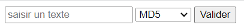

# Projet 1 

---
Concepteur: Christophe DUFOUR  
Contexte: formation devops AJC/Luminess
___

### Technos utilisées
python/flask, mariadb, docker, gitlab-ci

## A faire

### 1. Développer une micro web app en python/flask.

Cette application devra proposer une page web disposant:
- d'un input permettant de saisir une chaîne de caractères
- d'un menu déroulant (balise select) permettant de choisir une fonction de hash (md5, sha256)
- d'un bouton de validation optionnel

Le choix d'une option dans le menu déroulant devra afficher - sur une nouvelle page ou sur la page courante - le hash du texte saisi.

Si une variable d'environnement SAVE_DB=True est fournie à l'application:
Le texte saisi, le hash correspondant et la fonction de hash choisi devront également être enregistrés en base de données (mariadb) dans une table "projet1".
Cette table aura les colonnes suivantes: clearText, hashedText, hashFn

#### Liens utiles
- [Learn Flask for Python - Full Tutorial](https://youtu.be/Z1RJmh_OqeA)

### 2. Dockerisation
- Ecrire le Dockerfile permettant de conteneuriser l'application python/flask
- Ecrire le fichier docker-compose.yml file permettant de déployer localement un service flask et un service mariadb
- Faire un build de l'image et la pousser sur le docker hub.

### 3. CI/CD
- Configurer une pipeline gitlab-ci avec les deux jobs parallèles suivants
    - build_new_image: construction d'une image docker sur la base du Dockerfile présent à la racine du dépôt. Il s'agit d'un test "à vide", l'image ne sera pas conservée.
    - run_target_image: instanciation de l'image de l'application déjà construite et présente dans le docker hub

